# Laporan Praktikum Week 4

## 4.2
Perbedaan utama:
- Perintah 1 & 2 pakai DNS server default (fe80::...), Perintah 3 pakai Google DNS (8.8.8.8).
- DNS default timeout 2 detik dan hanya mengembalikan IPv6 untuk www.mit.edu
- Google DNS cepat dan mengembalikan IPv4 + IPv6.

Dampak terhadap informasi:
- Informasi dari DNS default tidak lengkap (IPv4 hilang) → bisa salah sangka bahwa situs tidak punya IPv4
- DNS default lambat → menghambat akses internet
- Jika perangkat/app tidak support IPv6, koneksi ke www.mit.edu gagal padahal sebenarnya bisa pakai IPv4
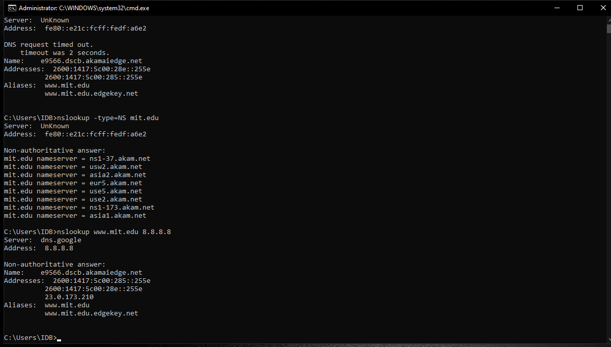

## 4.4
1. Ya, pakai UDP.
2. Untuk port tujuan adalah 53 dan sumbernya adalah 58847.
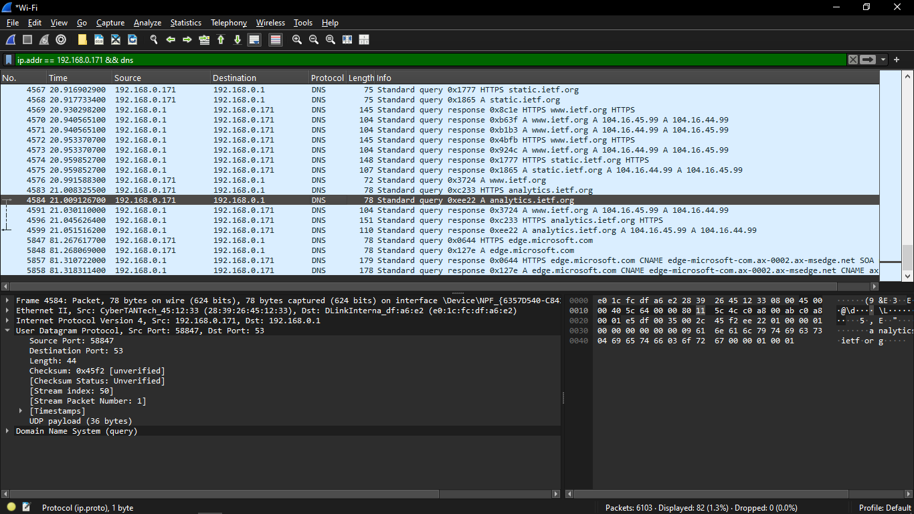
3. IP tujuan: 192.168.0.1, DNS lokal: 192.168.0.1, Ya sama.
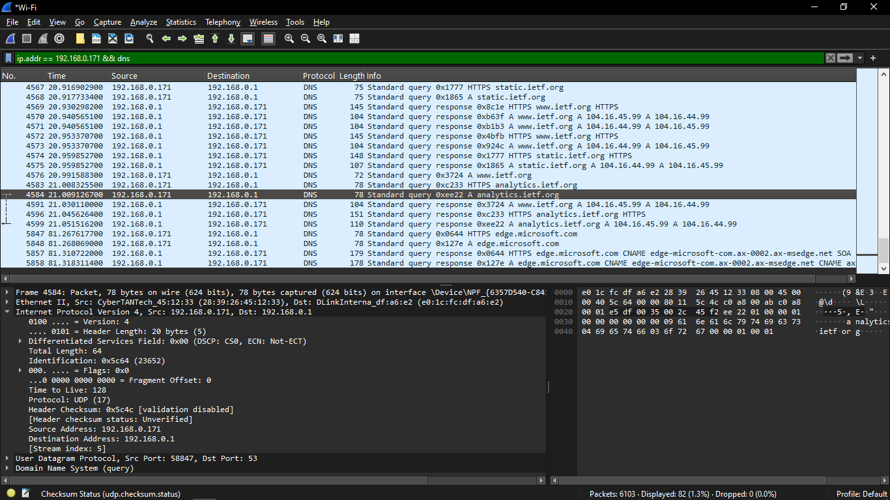
4. Type: A, tidak ada jawaban.
5. Ada 2
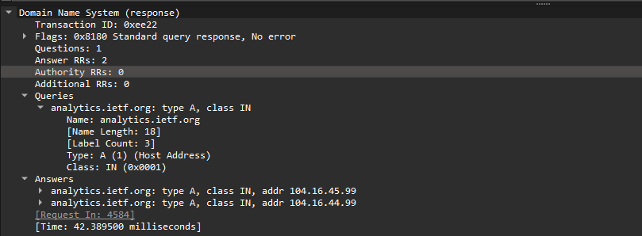
6. 
.png)
.png)
7. HOST tidak selalu mengirimkan permintaan DNS baru untuk mengakses suatu objek pada web, dikarenakan browser selalu menyimpan hasil dns pada cache.

## nslookup www.mit.edu
1. Port : 53
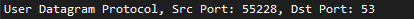
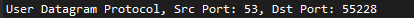
2. DNS lokal
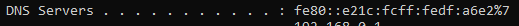
3. Type: AAAA
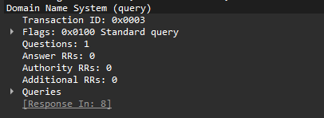
4. Ada 4
- Sebuah nama alias yang mengarah ke www.mit.edu.edgekey.net
- Sebuah nama alias yang mengarah ke e9566.dscb.akamaiedge.net
- Sebuah alamat IPv6 (Type AAAA) dari server tujuan akhir tersebut, yaitu 2600:1417:6000:1be::255e
- Sebuah alamat IPv6 alternatif (Type AAAA) dari server tujuan akhir tersebut, yaitu 2600:1417:6000:1a3::255e
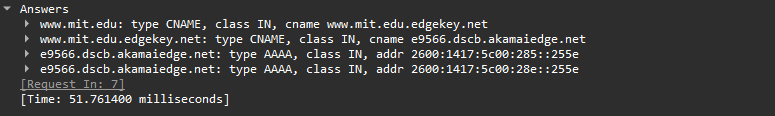
5. 
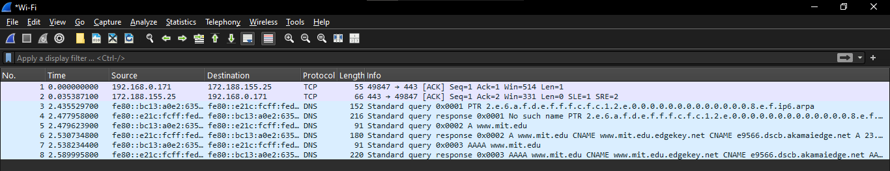

## nslookup -type=NS mit.edu
1. Sama 
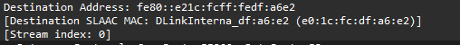
2. Type: NS
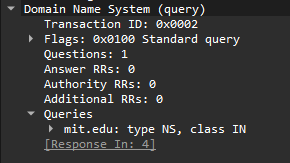
3. 
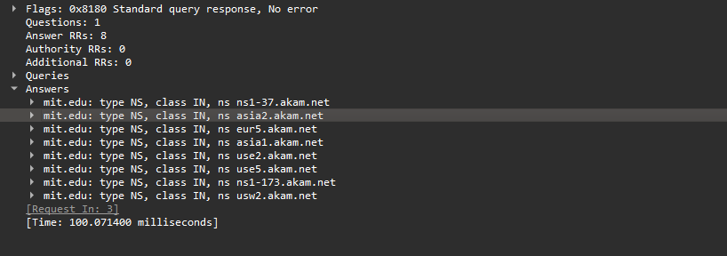
4. 
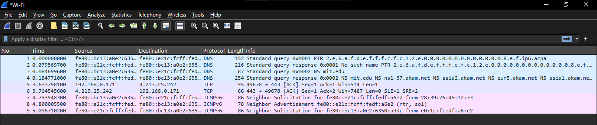

## nslookup www.alit.or.kr bitsy.mit.edu
1. Tidak, itu mengarah ke IP mit.edu
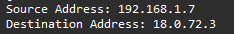
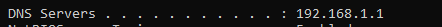
2. Type : AAAA, Tidak mengandung jawaban
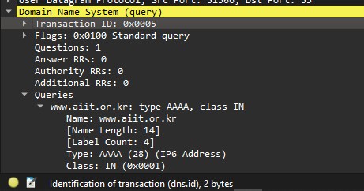
3. Tidak ada jawaban
4. 
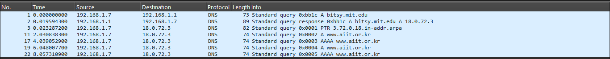