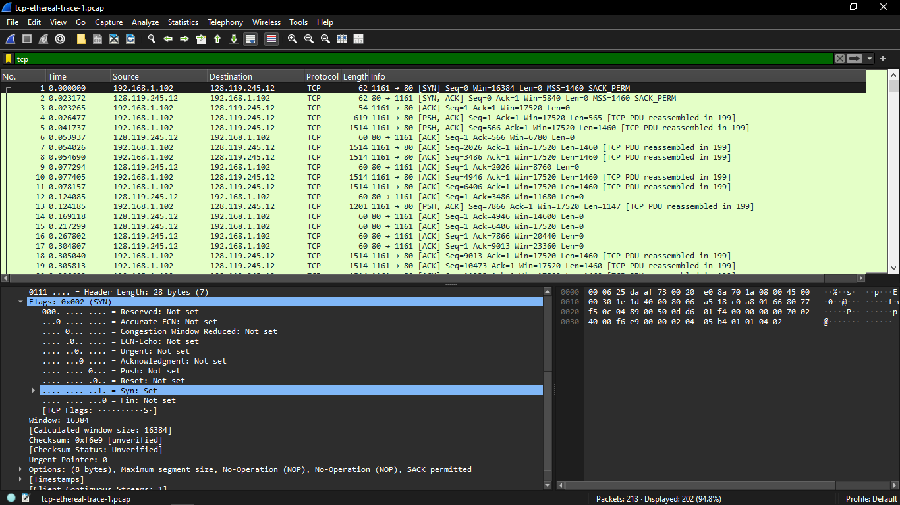
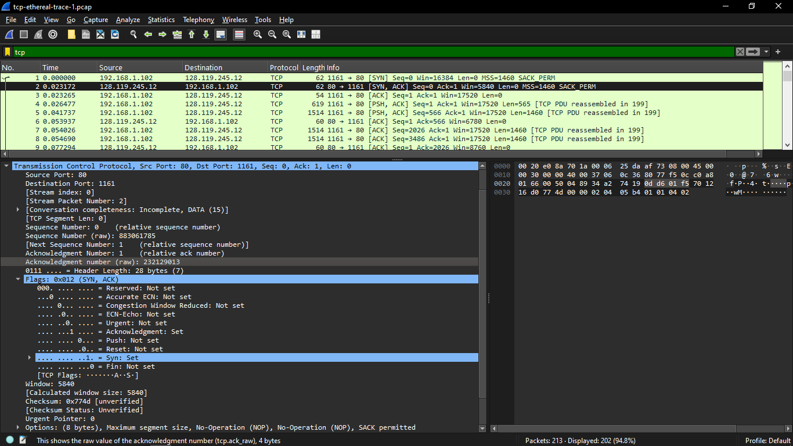
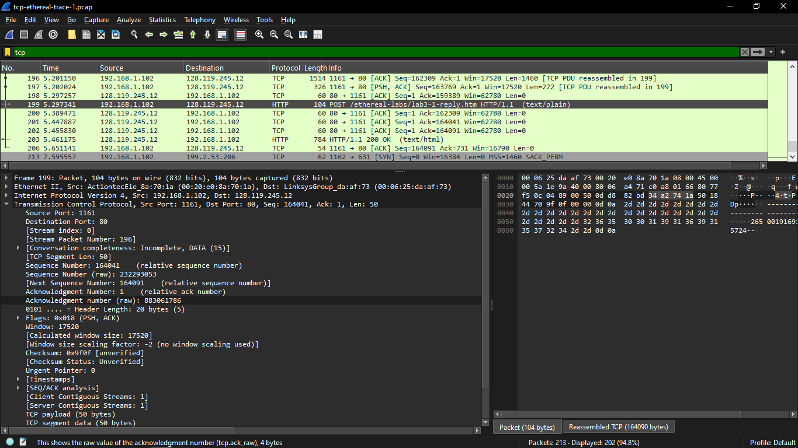
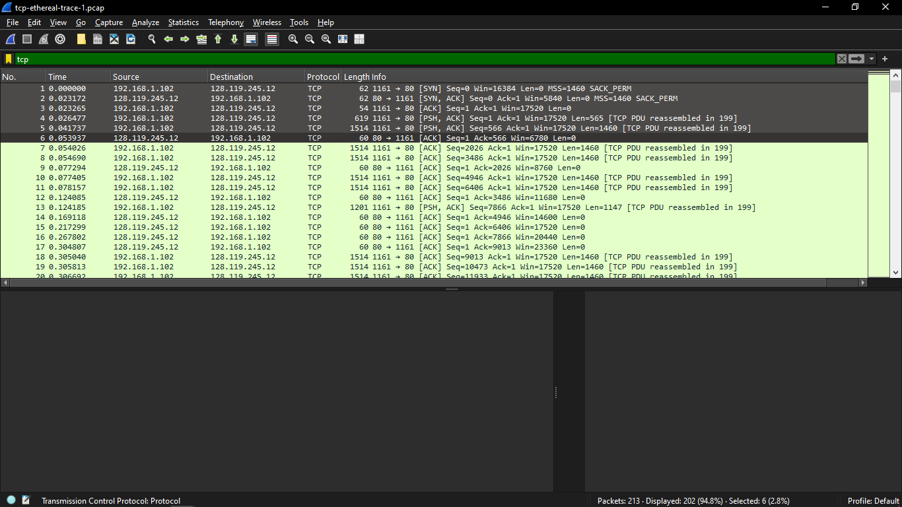
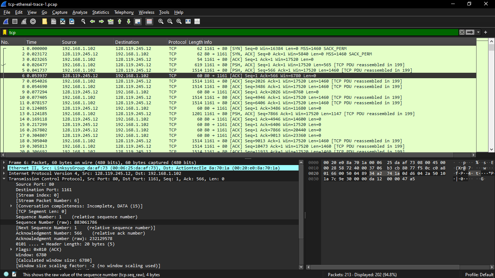
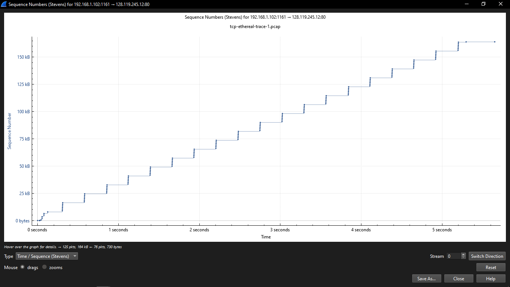

# Laporan Praktikum Week 6

## 6.3
1. IPv4, src: 10.218.9.158, port: 443
.png)
2. IP adress: 128.119.245.12, port: 80
.png)

## 6.4
1. Nomor urut segment: 0, ditandain dengan server dan client saling terhubung

2. Nomor urut segment: 0

3. Nomor urut segment: 164041

4. 
.png)
.png)
.png)
5. 

6. Win itu buffer, tidak akan menghambat praktikum

7. Tidak ada tcp retransmission

## 6.5

Slow start: ada lonjakan tertentu pada sewaktu-waktu (dibagian bawah) 
Congestion avoidance: waktunya flat dalam satu waktu (dibagian atas)